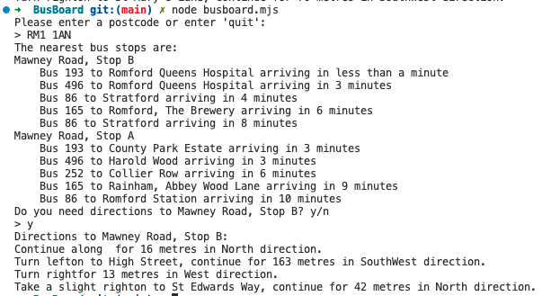

# Bus Board

A console application which finds the two nearest bus stops by a given postcode and shows the next five buses due at each stop as well as displays instructions how to get to the nearest stop. It also logs error and checks if the postcode is a valid London postcode


## To run the application

From command line: clone, npm install and node busboard.mjs
 
```
cd BusBoard
npm install
node busboard.mjs
```

### Usage

A user is prompted to enter a postcode. 

If the postcode is valid, two nearest bus stop names will be displayed as well as in how many minutes bus/buses will arrive. If there are no buses during 30 minutes then the message "No arrivals at stop [bus stop name]" will be displayed. The user will be asked if they want to get directions to the nearest stop. If the answer is yes, the directions will be shown.

In a case of entering a wrong postcode, the corresponding message will be displayed and the user will be prompted to enter a valid postcode.


<p float="center">

</p>

